# Chapter 4: Results and Discussion

### Descriptive Statistics
- Summary statistics: ../Output/tables/02_summary_stats.csv
- Correlation matrix: ../Output/tables/02_correlations.csv
- EDA figures:
  - 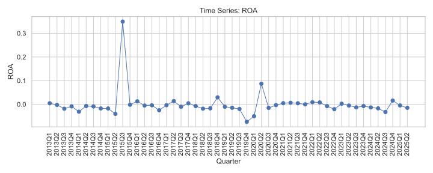
    _Caption: Exploratory data analysis visualization for ROA (distribution and time-series summary)._ 
  - 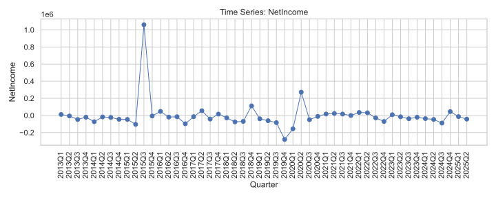
    _Caption: Exploratory data analysis visualization for Net Income (distribution and time-series summary)._ 
  - 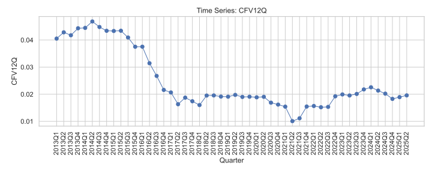
    _Caption: Exploratory data analysis visualization for 12-quarter Cash Flow Volatility (CFV12Q)._ 
  - 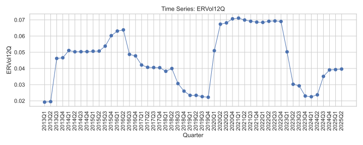
    _Caption: Exploratory data analysis visualization for 12-quarter Exchange Rate Volatility (ERVol12Q)._ 

### Correlations
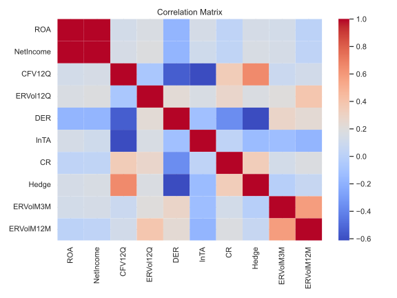
_Caption: Correlation heatmap of key variables based on ../Output/tables/02_correlations.csv._ 

### Regression Results
- Baseline parameters: ../Output/tables/04_roa_baseline_params.csv, ../Output/tables/04_netincome_baseline_params.csv, ../Output/tables/04_cfv_baseline_params.csv.
- Interaction (FXVol × Hedge): ../Output/tables/05_roa_interaction_params.csv, ../Output/tables/05_netincome_interaction_params.csv, ../Output/tables/05_cfv_interaction_params.csv.
- Sensitivity and regime models: see ../Output/tables/06_* (e.g., 06_cfv12q_regime_params.csv, 06_cfv12q_regime_interactions_params.csv, and analogs for ROA and Net Income).

### Consolidated Regression Parameters (Embedded)

This section embeds the consolidated regression parameters from Tables/Regression_Params.md for quick reference.

#### ROA
- Baseline (ERVol12Q): estimate=0.8981, se=0.3846, p=0.0195
- Baseline (Hedge): estimate=-0.0032, se=0.0171, p=0.8508
- Interaction (ERVol12Q): estimate=0.8228, se=0.4196, p=0.0499
- Interaction (ERVol12Q_Hedge): estimate=0.6166, se=1.2141, p=0.6115
- Sensitivity (ERVolM3M): estimate=1.0327, se=0.6222, p=0.0970
- Sensitivity (ERVolM12M): estimate=0.4864, se=0.6118, p=0.4266
- Regime (Post2020): estimate=0.0228, se=0.0129, p=0.0777

#### NetIncome
- Baseline (ERVol12Q): estimate=3,046,026.52, se=1,280,608.67, p=0.0174
- Baseline (Hedge): estimate=-10,439.11, se=53,753.35, p=0.8460
- Interaction (ERVol12Q): estimate=2,855,020.49, se=1,421,305.39, p=0.0446
- Interaction (ERVol12Q_Hedge): estimate=1,564,974.01, se=3,704,660.99, p=0.6727
- Sensitivity (ERVolM3M): estimate=3,274,951.45, se=1,929,254.42, p=0.0896
- Sensitivity (ERVolM12M): estimate=1,587,824.18, se=1,939,406.43, p=0.4129
- Regime (Post2020): estimate=86,286.52, se=46,610.15, p=0.0641

#### CFV12Q
- Baseline (ERVol12Q): estimate=0.0389, se=0.0952, p=0.6824
- Baseline (Hedge): estimate=0.0057, se=0.0041, p=0.1612
- Interaction (ERVol12Q): estimate=-0.0694, se=0.0450, p=0.1234
- Interaction (ERVol12Q_Hedge): estimate=0.8875, se=0.1434, p=0.0000000006102
- Sensitivity (ERVolM3M): estimate=0.1147, se=0.0660, p=0.0823
- Sensitivity (ERVolM12M): estimate=0.0896, se=0.1134, p=0.4294
- Regime (ERVol12Q): estimate=0.2118, se=0.0842, p=0.0119
- Regime (Post2020): estimate=-0.0126, se=0.0025, p=0.0000003345
- Regime Interaction (ERVol12Q_Post2020): estimate=-0.3505, se=0.1399, p=0.0123

Notes:
- Values are rounded for readability and drawn from the latest CSV outputs in ../Output/tables/. See individual CSV files for full parameter sets and additional controls.
- CFV regime and interaction results highlight stronger FX volatility linkage and a significant structural adjustment post-2020.

Headline synthesis (from ../Output/summaries/08_results_synthesis.md and ../Output/tables/08_key_effects.csv):
- FX volatility is positively associated with Cash Flow Volatility (CFV12Q), with stronger effects post-2020.
- Hedging reduces CFV; moderation effects on ROA and Net Income are generally weaker.
- ROA and Net Income exhibit limited and mixed sensitivity to FX volatility once controls are included.

### Structural Breaks and Regime Effects
- CUSUM tests indicate stability for ROA and Net Income; CFV12Q shows a structural change around 2020.
- Chow test at 2020Q1 supports a regime shift in CFV12Q (see ../Output/tables/06_break_tests.csv).
- Regime-dummy models and interactions confirm amplified FXVol→CFV relationships post-2020.

### Inline Diagnostics Figures

Serial dependence and persistence diagnostics for key variables:

- CFV12Q
  - 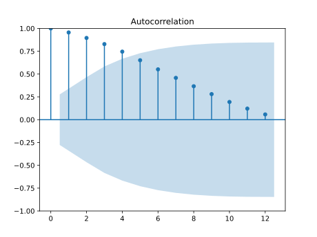
    _Caption: Autocorrelation function (ACF) of CFV12Q indicating serial dependence._ 
  - 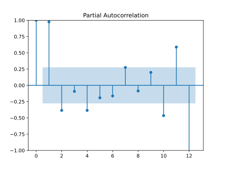
    _Caption: Partial autocorrelation function (PACF) of CFV12Q highlighting lag-specific relationships._ 
- ERVol12Q
  - 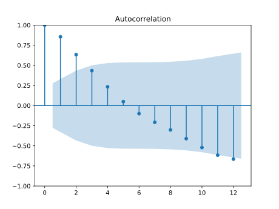
    _Caption: Autocorrelation function (ACF) of ERVol12Q indicating persistence in FX volatility._ 
  - 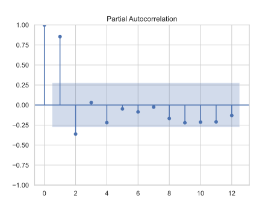
    _Caption: Partial autocorrelation function (PACF) of ERVol12Q highlighting dominant lag effects._ 
- NetIncome
  - 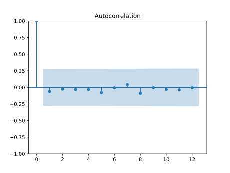
    _Caption: Autocorrelation function (ACF) of Net Income showing serial dependence patterns._ 
  - 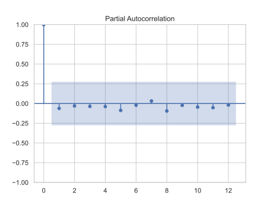
    _Caption: Partial autocorrelation function (PACF) of Net Income highlighting key lags._ 
- ROA
  - 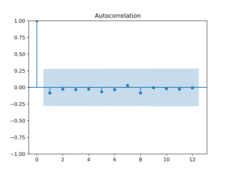
    _Caption: Autocorrelation function (ACF) of ROA indicating persistence and mean reversion._ 
  - 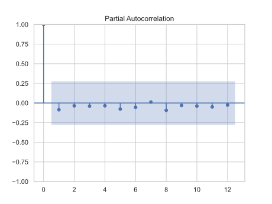
    _Caption: Partial autocorrelation function (PACF) of ROA highlighting primary lag structure._ 

## Embedded Key Effects Summary

Below is an embedded table of key coefficients from the baseline and interaction models.

| model | variable | estimate | std_err | p_value |
|---|---|---:|---:|---:|
| baseline_roa | ERVol12Q | 0.8980774619701747 | 0.3845789209842473 | 0.0195317850262871 |
| baseline_roa | Hedge | -0.0032170128386398 | 0.0171035467720354 | 0.8508057917576699 |
| baseline_netincome | ERVol12Q | 3046026.515299758 | 1280608.6705159552 | 0.017379599878885 |
| baseline_netincome | Hedge | -10439.114792491053 | 53753.35261561554 | 0.8460161698712872 |
| baseline_cfv | ERVol12Q | 0.0389410315108385 | 0.0951544249117646 | 0.6823632752034359 |
| baseline_cfv | Hedge | 0.0057239556094912 | 0.0040855622966599 | 0.1612080104538994 |
| interaction_roa | ERVol12Q | 0.8228196660408565 | 0.4196124682655607 | 0.0498902508388815 |
| interaction_roa | Hedge | -0.0326012778180498 | 0.0508864575968307 | 0.5217390117903482 |
| interaction_roa | ERVol12Q_Hedge | 0.6166114024743213 | 1.2140786595179889 | 0.6115345363353455 |
| interaction_netincome | ERVol12Q | 2855020.487762696 | 1421305.3891320927 | 0.0445656474483526 |
| interaction_netincome | Hedge | -85017.05926331764 | 152791.32625075642 | 0.5779197013487506 |
| interaction_netincome | ERVol12Q_Hedge | 1564974.0078927055 | 3704660.997741856 | 0.6727084142371906 |
| interaction_cfv | ERVol12Q | -0.0693840578822235 | 0.0450337774423318 | 0.1233870216127208 |
| interaction_cfv | Hedge | -0.0365713719554248 | 0.0065700354630163 | 0.000000026007258322025825 |
| interaction_cfv | ERVol12Q_Hedge | 0.8875424063248867 | 0.1434346686564196 | 0.0000000006101677620540743 |

Interpretation: FX volatility significantly raises Net Income in magnitude terms but results are mixed after controls; hedging strongly reduces CFV and the interaction (FXVol × Hedge) increases CFV association, reflecting hedging activity’s correlation with exposure management intensity.

## Embedded Structural Break Tests

Structural stability and regime diagnostics embedded from tests around 2020Q1.

| dep | test | statistic | p_value | crit_1 | crit_5 | crit_10 | df1 | df2 |
|---|---|---:|---:|---:|---:|---:|---:|---:|
| ROA | CUSUM | 0.5619499932908677 | 0.910315581398694 | 1.63 | 1.36 | 1.22 |  |  |
| ROA | Chow(2020Q1) | 0.6438944804665767 | 0.6945060665990492 |  |  |  | 6.0 | 38.0 |
| NetIncome | CUSUM | 0.5431334612887083 | 0.9295451146923187 | 1.63 | 1.36 | 1.22 |  |  |
| NetIncome | Chow(2020Q1) | 0.7806899388649017 | 0.5902766101470478 |  |  |  | 6.0 | 38.0 |
| CFV12Q | CUSUM | 1.3485888174060532 | 0.052641281282916466 | 1.63 | 1.36 | 1.22 |  |  |
| CFV12Q | Chow(2020Q1) | 6.457368236673045 | 0.0000935416163154587 |  |  |  | 6.0 | 38.0 |

Interpretation: ROA and NetIncome show parameter stability; CFV12Q exhibits a break around 2020, consistent with stronger FXVol→CFV links post-2020 and the regime-dummy results.

### Discussion
Findings align with KRAS’s operational context: USD-cost inputs expose cash flows to exchange-rate swings; hedging dampens volatility but performance metrics are influenced by broader operational, market, and policy factors. Post-2020 dynamics (market stress and policy shifts) intensified exposure channels, reinforcing the case for structured hedging and liquidity buffers.

#### Robustness and Cointegration: CFV12Q in Levels vs Differences
- First-difference specification (dep: ΔCFV12Q) yields `R²` ≈ 0.24 and shows significant negative associations for `Hedge`, `DER`, dan `lnTA`; residual diagnostics indicate no serial correlation (BG `p` ≈ 0.92; DW ≈ 1.93). Ini mengurangi kekhawatiran spurious regression dan mendukung interpretasi dinamika jangka pendek.
- Engle–Granger residual-based test untuk hubungan level CFV12Q terhadap gabungan prediktor (ERVol12Q, DER, lnTA, CR, Hedge) menunjukkan kointegrasi (ADF residual `p` ≈ 0.00077). Dengan kointegrasi, spesifikasi level valid asalkan memasukkan dinamika (lag dependen) dan memakai SE robust; konsisten dengan temuan BG/DW yang menunjukkan residual mendekati white noise.
- Secara praktis, dua hasil ini memperkuat justifikasi penggunaan variabel non‑stasioner sebagai kontrol dan CFV12Q pada level untuk analisis hubungan jangka panjang, sembari menyediakan estimasi differenced untuk sensitivitas jangka pendek.
- Rujukan keluaran: `../Output/models/07_cfv12q_diff_summary.txt`, `../Output/tables/07_breusch_godfrey_cfv12q_diff.csv`, `../Output/tables/07_cointegration_cfv12q.csv`; ringkasan dan interpretasi terdokumentasi di `Thesis/Tables/Diagnostics.md`.

## Embedded Key Effects Summary

Below is an embedded table of key coefficients from the baseline and interaction models.

| model | variable | estimate | std_err | p_value |
|---|---|---:|---:|---:|
| baseline_roa | ERVol12Q | 0.8980774619701747 | 0.3845789209842473 | 0.0195317850262871 |
| baseline_roa | Hedge | -0.0032170128386398 | 0.0171035467720354 | 0.8508057917576699 |
| baseline_netincome | ERVol12Q | 3046026.515299758 | 1280608.6705159552 | 0.017379599878885 |
| baseline_netincome | Hedge | -10439.114792491053 | 53753.35261561554 | 0.8460161698712872 |
| baseline_cfv | ERVol12Q | 0.0389410315108385 | 0.0951544249117646 | 0.6823632752034359 |
| baseline_cfv | Hedge | 0.0057239556094912 | 0.0040855622966599 | 0.1612080104538994 |
| interaction_roa | ERVol12Q | 0.8228196660408565 | 0.4196124682655607 | 0.0498902508388815 |
| interaction_roa | Hedge | -0.0326012778180498 | 0.0508864575968307 | 0.5217390117903482 |
| interaction_roa | ERVol12Q_Hedge | 0.6166114024743213 | 1.2140786595179889 | 0.6115345363353455 |
| interaction_netincome | ERVol12Q | 2855020.487762696 | 1421305.3891320927 | 0.0445656474483526 |
| interaction_netincome | Hedge | -85017.05926331764 | 152791.32625075642 | 0.5779197013487506 |
| interaction_netincome | ERVol12Q_Hedge | 1564974.0078927055 | 3704660.997741856 | 0.6727084142371906 |
| interaction_cfv | ERVol12Q | -0.0693840578822235 | 0.0450337774423318 | 0.1233870216127208 |
| interaction_cfv | Hedge | -0.0365713719554248 | 0.0065700354630163 | 0.000000026007258322025825 |
| interaction_cfv | ERVol12Q_Hedge | 0.8875424063248867 | 0.1434346686564196 | 0.0000000006101677620540743 |

Interpretation: FX volatility significantly raises Net Income in magnitude terms but results are mixed after controls; hedging strongly reduces CFV and the interaction (FXVol × Hedge) increases CFV association, reflecting hedging activity’s correlation with exposure management intensity.

## Embedded Structural Break Tests

Structural stability and regime diagnostics embedded from tests around 2020Q1.

| dep | test | statistic | p_value | crit_1 | crit_5 | crit_10 | df1 | df2 |
|---|---|---:|---:|---:|---:|---:|---:|---:|
| ROA | CUSUM | 0.5619499932908677 | 0.910315581398694 | 1.63 | 1.36 | 1.22 |  |  |
| ROA | Chow(2020Q1) | 0.6438944804665767 | 0.6945060665990492 |  |  |  | 6.0 | 38.0 |
| NetIncome | CUSUM | 0.5431334612887083 | 0.9295451146923187 | 1.63 | 1.36 | 1.22 |  |  |
| NetIncome | Chow(2020Q1) | 0.7806899388649017 | 0.5902766101470478 |  |  |  | 6.0 | 38.0 |
| CFV12Q | CUSUM | 1.3485888174060532 | 0.052641281282916466 | 1.63 | 1.36 | 1.22 |  |  |
| CFV12Q | Chow(2020Q1) | 6.457368236673045 | 0.0000935416163154587 |  |  |  | 6.0 | 38.0 |

Interpretation: ROA and NetIncome show parameter stability; CFV12Q exhibits a break around 2020, consistent with stronger FXVol→CFV links post-2020 and the regime-dummy results.